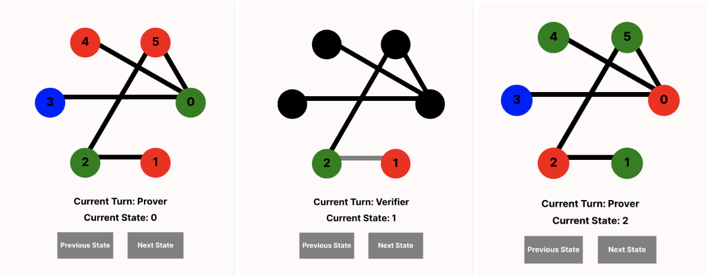
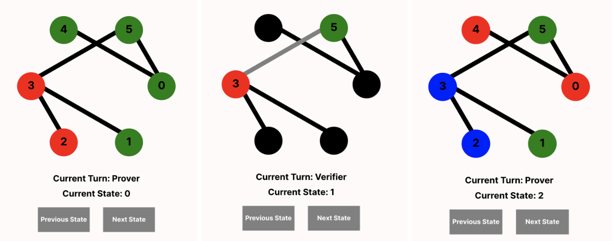

# [Zero-Knowledge-Proof](https://github.com/Alyssa2026/Zero-Knowledge-Proof)

#### Authors: Alyssa Sun, Khalil Desai, and Sarah Ridley

#### Due: May 11, 2024

#### Resources:

- [Demo video (~2 min)](https://drive.google.com/file/d/1TLWvnhGV7MxJhytQGfPi1CLTrKwLIjnM/view?usp=drive_link)

- [Presentation slides](https://docs.google.com/presentation/d/1f05vo6Dh-0K5KE950Fz1mIfhSCe7LrZxXtftO_Vk6lE/edit#slide=id.gc6f90357f_0_13)

- [Main academic source: _Proofs that Yield Nothing But Their Validity All Languages in NP Have Zero-Knowledge Proof Systems_](https://people.csail.mit.edu/silvio/Selected%20Scientific%20Papers/Zero%20Knowledge/Proofs_That_Yield_Nothing_But_Their_Validity_or_All_Languages_in_NP_Have_Zero-Knowledge_Proof_Systems.pdf)

# Project Objective

Many cryptographic procedures are primarily concerned with the secure, faithful, and efficient transfer of information between digital parties. The data to be shared — whatever form it may take — is intended to be known at both ends, and the difficulty is in the movement of said data. However, in the 1980s a group of researchers (Goldwasser, Micali, and Rackoff) proposed an alternative type of procedure, one which obscured certain details away from the receiving-end of the information. This idea was termed a “zero-knowledge proof system”.

What exactly is achieved in such a system? Zero-knowledge proof systems are a kind of interactive proof system, theoretical setups in which two distinct parties, a prover and a verifier, exchange messages. In an interactive proof-system the prover generally aims to completely convince the verifier of some mathematical statement. Before the work by Goldwasser et al., computer scientists had been mostly concerned with the ‘soundness’ and ‘completeness’ of such systems — soundness being the property where the verifier can only be convinced of a true fact and completeness being the property where the verifier can be convinced of every true fact. Now, a new property was being contemplated: ‘zero-knowlegeness’, or the property where no additional information beyond the truth of the statement is conferred to the verifier across the procedure.

What exactly does that mean? What does it look like in practice? To broach some of these questions, we decided to focus our CS1710 final project on modeling an actual implementation of one of these zero-knowledge proof systems, a method of proving that a certain party has a 3-coloring of a graph with no adjacent nodes of the same color. The choice of modeling a zero-knowledge proof system for specifically graph 3-coloring was duly motivated — graph 3-coloring is an NP-complete problem to which all other NP problems can be reduced, so by showing a system exists for graph 3-coloring, we by extension show it exists for all other NP problems.

The procedure we modeled has the following shape. The prover either has or does not have a valid 3-coloring of a particular graph. If they do have such a coloring:

1. At the start of a round, the prover randomly permutes the three colors. That is they establish a random bijective mapping from the set of the three colors to the set of the three colors.
2. The prover colors in the graph using the random mapping and their original solution.
3. The prover covers all of the nodes, leaving only the structure of the graph visible (we refer to this as covering the nodes with “hats”).
4. The prover sends this covered graph to the verifier, who selects an edge to challenge.
5. The prover uncovers the two nodes at either end of the edge. They should always be different if the prover has a solution and follows the protocol.
6. After m^2 rounds (steps 1-5) for an m-edge graph, the verifier is convinced.

If the prover does not have a valid solution, then we consider them a “cheating” or dishonest prover. In this case, the coloring they send over each round is arbitrary, and the verifier has at least a 1/m chance of challenging an invalid edge (as their solution is not a correct 3-coloring, and thus has at least one edge with same-color ends). Thus, there is at most a **(1 - 1/m)^(m^2) ≈ e^-m** chance a dishonest prover successfully convinces a verifier.

Note that in the digital implementation of this procedure, an encryption scheme guarantees that the colors are not changed after the prover sends over the graph. This means that the prover cannot recolor any nodes after learning which edge the verifier intends to challenge — i.e. they can’t tailor their invalid solution to specifically pass the challenges.

Overall, our project modeling zero-knowledge proofs using Forge was a fascinating foray into a highly conceptual part of cryptography that is underexplored. While much more work integrating the theoretical basis of these procedures with modeling tools like boolean satisfiability solvers could definitely be undertaken, we hope our efforts help characterize some of the possibilities.

## Stakeholders

We also wanted to briefly note the various stakeholders we had in mind for our project. In our final project proposal, we discussed how zero-knowledge proof systems are relevant to a large variety of cryptographic applications. Ths includes safely verifying aspects of your identity to a third-party, or in a Blockchain system to verifying software updates are from the correct manufacturer. While our project itself is not an application that enables these zero-knowledge proofs, we think it is important to note that currently, zero-knowledge proofs are still not very widely used in industry. We believe that they have a lot of potential and would be appealing to consumers who want to use products that keep their private data safe. However, zero-knowledge proofs in themselves are somewhat complex to understand. As such, our model offers an accessible, interactive way to understand zero-knowledge proofs.

Also, we think it is valuable to these same stakeholders to be able to 'prove' (we use this term loosely, due to the limitation of our model) that the procedure is complete. Also, we think that proving that the procedure is unsound is valuable because it demonstrates the real possibility that a dishonest prover tricks the verifier, however unlikely this is. This also serves the purpose of helping make these abstract probabilistic and cryptographi concepts more real to industry professionals, aspiring cryptographers, and anyone else interested in protecting their data!

# Model Design and Visualization

## Design Choices

_What tradeoffs did you make in choosing your representation? What else did you try that didn’t work as well?_

The first significant design choice we made was how to represent graphs in our model. We started with the assumption that our model would only ever represent one graph at a time, so instead of making a sig for a graph, we made a sig for Nodes, which then are assumed to all be nodes of the same graph. This made it much simpler for us to reason about neighbor connections and nodes with very few sigs in our model. We believe that this makes our current model simpler to understand and wrap your head around as an outsider looking at our work. However, one tradeoff of this decision to implicitly only have one graph per instance is that it makes it impossible, as the model is currently designed, to reason about other graphs or other colorings of the same graph in the same instance. For our current model, this is fine, because we only need one graph for the run of the procedure. However, as we discuss below, one possible extension to our work would be reasoning about the zero-knowledgeness property of zero-knowledge proofs, which might require reasoning about other versions and colorings of the graph. So, if we were to explore that direction, we would likely need to fundamentally redesign our model and how we represent graphs and their colorings.

Another significant design decision we made was that the colors of the nodes are permuted in the verifierToProver step, not in the proverToVerifier step. At a first glance, this seems like an non intuitive choice, and originally, we had this set up in the opposite way. Shouldn’t the prover be the one permuting the colors during their turn, not during the verifier’s turn? While this is true, we want to be able to see the prover’s new selection of colors during their turn. So, in the prover state, the colors must already be permuted. If we had a notion of previous_state in forge, we could say in the prover’s turn that the colors in this state must be permuted from the colors in the previous_state. However, we only have next_state, not previous_state. So, during the verifier’s turn, we must say that in the next_state, the colors have to be a permutation of how they are in the current state. So, as we transition from the verifier to the prover, the colors are permuted, and we can see the new coloring in the prover’s state.

_Did your goals change at all from your proposal? Did you realize anything you planned was unrealistic, or that anything you thought was unrealistic was doable?_

Our goals did not change majorly from our proposal. As expected, a large part of our time working on this project was reading the [research paper](https://people.csail.mit.edu/silvio/Selected%20Scientific%20Papers/Zero%20Knowledge/Proofs_That_Yield_Nothing_But_Their_Validity_or_All_Languages_in_NP_Have_Zero-Knowledge_Proof_Systems.pdf) and watching videos online to each get a better grasp on zero-knowledge proofs in general, as well as the specific application to graph three colorings. Then, we worked on modeling graph three colorings, then moved onto modeling the procedure itself. Finally, we were able to prove two properties about the model, completeness and unsoundness! When we initially proposed this project, we were not even sure that we would be able to prove anything. So, we were pleasantly surprised that proving these properties was something that we could conceptually understand how to do, and even do in forge! We were not able to prove the zero-knowledgeness property, but we had expected from the beginning that this would be very difficult. In this vein, see the limitations section below for a better idea of the limitations our model currently faces.

## Visualization

We created a custom visualizer for this model in vis_coloring.js. To run the visualizer, open the ZKP.frg file and press the run button. This should open a sterling window in your web browser, where you should select “Script” in the top right corner. Unfortunately, our visualizer does not currently load automatically, so you must copy the text from vis_coloring.js into the middle pane of sterling (make sure that “svg” is selected). Then, press the blue “Run” button to see the visualizer in action. You can also press the “Next Config” button and then the “Run” button again to see a different instance.

_How should we understand an instance of your model and what your visualization shows (whether custom or default)?_

One instance of our model displays one run of this zero-knowledge proof procedure. As displayed by the visualizer, one run of this procedure involves one graph. For our examples, we chose to constrain the graph to 6 nodes and m = 5 edges, however this is not required for the properties that we demonstrated about these zero-knowledge proofs in general. In this proof, there are two entities, the prover and the verifier. The goal of the prover is to convince the verifier that the prover has a valid three coloring of the graph (every node is one of three colors, and no two adjacent nodes have the same color).

We start with the verifier out of eyeshot, and the prover colors in the graph. The verifier displays that we are currently in state 0, and it is the prover’s turn (even turns are the prover, odd turns are the verifier). An honest prover will do a valid three coloring of the graph, while a dishonest prover can color the graph however they want (usually because there is no valid three coloring of the graph, but this is not technically required, as the dishonest prover to do an invalid coloring even if a valid one exists). Now, we progress to state 1, and it is the verifier’s turn. The nodes are covered up for the verifier, and the verifier gets to choose one edge in the graph. The prover must reveal the colors of the nodes (the prover cannot decide to change them last minute) to the verifier. In the visualizer, we can see the chosen edge in gray, and the colors of the two nodes along that edge are revealed. If the verifier chose an edge where the nodes are the same color, the verifier has caught the prover in a lie, and the procedure would stop.

However, if the verifier discovers nodes of different colors, and the procedure continues. In state 2, it is the prover’s turn again, and they must randomly permute the colors of the nodes such that the coloring is still the same valid three coloring, but the colors have simply been rearranged. Note that, as the [research paper](https://people.csail.mit.edu/silvio/Selected%20Scientific%20Papers/Zero%20Knowledge/Proofs_That_Yield_Nothing_But_Their_Validity_or_All_Languages_in_NP_Have_Zero-Knowledge_Proof_Systems.pdf) explains, if the prover can play by whatever rules they want, and rearrange the colors however they want to (they do not have to make sure that all reds in this turn become the same color in the next turn, for example).

**Valid Three Coloring:**

As the [research paper](https://people.csail.mit.edu/silvio/Selected%20Scientific%20Papers/Zero%20Knowledge/Proofs_That_Yield_Nothing_But_Their_Validity_or_All_Languages_in_NP_Have_Zero-Knowledge_Proof_Systems.pdf) explains, this procedure must repeat edges2 times. Then, “no matter how the prover plays,” after edges2 trials of not finding any bad edges, the verifier can have roughly 1 - e^(-edges) confidence that the prover has a valid three coloring. In other words, there is only a e^(-edges) probability that the prover did not have a valid three coloring (and was not playing by the rules) and fooled the verifier. In our case, e^-m = e^-5 ≈ 0.006738.

Also note that because we have two temporal states for each trial of the proof (one prover turn and one verifier turn), we constrained our tracelength to exactly 50 (m = 5, so m^2 = 25, so we need 50 traces for 25 trials).

In the above visualizer example, the prover has a valid three coloring of the graph. Here is another brief example (not all 50 traces) of an invalid three coloring. This is an instance where the verifier does not catch the prover after 50 traces. As discussed, this zero-knowledge proof procedure is based on the probabilistic models presented in the [research paper](https://people.csail.mit.edu/silvio/Selected%20Scientific%20Papers/Zero%20Knowledge/Proofs_That_Yield_Nothing_But_Their_Validity_or_All_Languages_in_NP_Have_Zero-Knowledge_Proof_Systems.pdf). As such, they acknowledge that there is a chance for the verifier to be fooled, although this chance is small (e^-m, as discussed in the project overview). Regardless, this demonstrates that the procedure is not fully sound.

**Invalid Three Coloring:**

# Signatures and Predicates

## Signatures

- **Color:** This sig is abstract, and represents one of the three colors that a node can be. The three sigs that extend Color and Red, Blue, and Green. These sigs have no fields.
- **Hat:** This sig represents the presence of a hat over a node in the graph (see the hat field of the Node sig). No nodes have hats during a prover turn, and all but two nodes have hats during a verifier turn (the two nodes attached to the revealed edge do not have a hat, as they have been revealed). This sig has no fields.
- **Node:** The sig that represents a node in the graph. Its fields are…
  - **neighbors:** a set of Node sigs containing all the nodes that this node shares an edge with. The neighbors set is not variable (it does not change between states).
  - **color:** a Color sig representing the current color of this node.
  - **hat:** a Hat sig representing whether the node is covered (is one Hat if the node is covered, and is none if the node is covered).
- **Participant:** The sig that represents the participants in this zero-knowledge proof procedure. The two sigs that extend Participant are Prover and Verifier. These sigs have no fields.
- **Proof State:** The sig representing overall properties of the current state of the procedure. Its fields are…
  - **turn:** a Participant sig containing the Prover sig if it is the prover’s turn, and the Verifier sig if it is the verifier’s turn.
  - **nodeA:** a Node sig containing either none or one of the Node sigs that is currently revealed. It will always be none during the prover’s turn, as there is no reveal during the prover’s turn.
  - **nodeB:** a Node sig containing either none or the other of the Node sigs that is currently revealed. It will also always be none during the prover’s turn. Together, nodeA and nodeB form the edge that the verifier picked to reveal during their turn.

## Predicates

- **validGraph:** This predicate enforces that the graph represented by the nodes and neighbors constitute a valid graph. In our model, a valid graph must be connected, meaning that there must be some path of edges to traverse between any two nodes. It also ensures that the neighbor relationship is symmetric. Finally, it ensures that no node is a neighbor with itself.
- **validThreeColor:** This predicate enforces that the coloring of the nodes represent a valid three coloring. This means that no two neighboring nodes (nodes that share an edge) are the same color.
- **init:** This short predicate constrains that in the initial state, it is the prover’s turn. This makes sense because the prover takes the first turn, where it arranges the color of the graph for the first time.
- **verifierToProver:** This predicate represents the actions of the verifier during their current turn and the transition to the prover’s turn. The verifier picks one edge, so this predicate constrains that they pick some edge between two nodes, which are nodeA and nodeB in the ProofState sig. Also, these two nodes no longer have hats as they have been revealed by the verifier. All other nodes are covered by hats. Then, we must transition to the prover’s turn, so we constrain that in the next state, the colors are validly permuted. This is how we chose to represent the prover rearranging the colors, because in the next_state, which is what we are constraining over, it is the prover’s turn. This is necessary because there is no concept of previous_state, so we cannot constrain this transition once it has already become the prover’s turn.
- **proverToVerifier:** This predicate represents the transition between the prover’s turn to the verifier’s turn. This predicate specifies that the ProofState’s nodeA and nodeB fields are both none, as there is no selected edge during the prover’s turn. We also specify that in the transition from the prover’s current turn to the verifier’s turn in the next_state, none of the colors of the nodes change.
- **move:** This predicate organizes how turns are taken by swapping between it being the prover’s turn and the verifier’s turn every state. It also constrains that if it is currently the prover’s turn, the proverToVerifier predicate is enforced, and if it is currently the verifier’s turn, the verifierToProver predicate is enforced.
- **validTraces:** This predicate organizes a valid trace by enforcing init, validGraph, validThreeColor, and always move.
- **verifierToProverInvalid:** Like verifierToProver, this predicate represents the actions of the verifier during their current turn and the transition to the prover’s turn. The main difference is that in an invalid run, the prover can rearrange the colors of nodes however they want. So, unlike verifierToProver, we do not constrain how the colors change when it becomes the prover’s turn, representing how the prover can reorganize colors however they want. However, the verifier still plays faithfully and picks and edge to uncover.
- **moveInvalid:** Like the move predicate, this predicate organizes how turns are taken by swapping between it being the prover’s turn and the verifier’s turn in every state. It also constrains that if it is currently the prover’s turn, the proverToVerifier predicate is enforced. However, if it is currently the verifier’s turn, the verifierToProverInvalid predicate is enforced.
- **invalidTraces:** This predicate organizes an invalid traces by enforcing init, validGraph, not validThreeColor, and always moveInvalid.
- **fiveEdges:** This predicate enforces that there are 5 edges in the graph. In the predicate itself, we specify 10, but this is because the neighbor relation is symmetric, so more simply put, there are 10 nodes that have neighbors.
- **passesChallenge:** This predicate constrains that either no nodes are currently revealed (meaning it is the prover’s turn) or that if there are nodes revealed (it is the verifier’s turn), then the nodes are different colors. This predicate is used with ‘always’ to show that in the valid case, passesChallenge always holds.
- **failsChallenge:** This predicate constraints that there are some nodes that are revealed and they are the same color. This predicate is used to show that it is possible (satisfiable) that in the invalid case, failsChallenge may ‘eventually’ be true.

# Testing

We have a few tests in our main file, called ZKP.frg, but the majority of our tests are in ZKP.tests.frg. The three tests in ZKP.frg demonstrate the properties that our model seeks to prove and display.

The first of the three tests, notSound, demonstrates that this zero-knowledge proof procedure is not fully sound. In order to be truly sound, it must be true that a dishonest prover (who does not have a valid three coloring) would always be caught. However, we demonstrate that a dishonest prover may pass every challenge from the prover. This procedure itself is based on a probabilistic model, so its soundness is also not guaranteed. According to the [paper](https://people.csail.mit.edu/silvio/Selected%20Scientific%20Papers/Zero%20Knowledge/Proofs_That_Yield_Nothing_But_Their_Validity_or_All_Languages_in_NP_Have_Zero-Knowledge_Proof_Systems.pdf), the probability of a dishonest prover not being caught is only e^-m. The goal of our model was to demonstrate that this is still an important possible scenario, which makes this procedure not fully sound.

The second of the three tests, canBeSound, simply shows that it is possible for a dishonest prover to be caught (however this is sat, not theorem, as the dishonest prover might not be caught). The third test, complete, demonstrates the completeness property of this procedure. If the prover is honest and has a valid three coloring, they will always pass all of the edges2 challenges and effectively convince the verifier.

On the other hand, the tests in ZKP.tests.frg seek to test the model itself for correctness. To run these tests, open the ZKP.test.frg and press the Run button. At the top of this file are tests that examine the predicates in combination to verify that they interact and constrain the model together as we expect. Further down in that file, we also test every predicate individually to make sure that each individual predicate has the properties that we expect.

As we were testing, we found and resolved some small bugs, which was very helpful!

# Limitations

_What assumptions did you make about scope? What are the limits of your model?_

In scoping our project, we knew that the most challenging part would be collectively wrapping our heads around the procedure of these zero-knowledge proofs on graph three colorings, as well as trying to understand the probabilistic outcomes of the procedure. So, we knew that we might not be able to model the entire procedure completely faithfully, but we were still very excited about the opportunity to understand such an interesting and potentially widely applicable model.

The [research paper](https://people.csail.mit.edu/silvio/Selected%20Scientific%20Papers/Zero%20Knowledge/Proofs_That_Yield_Nothing_But_Their_Validity_or_All_Languages_in_NP_Have_Zero-Knowledge_Proof_Systems.pdf) we cited above dives deep into the details of this procedure, which we were not able to model entirely accurately. Specifically, one limitation of our model was that the procedure described in the [research paper](https://people.csail.mit.edu/silvio/Selected%20Scientific%20Papers/Zero%20Knowledge/Proofs_That_Yield_Nothing_But_Their_Validity_or_All_Languages_in_NP_Have_Zero-Knowledge_Proof_Systems.pdf) specifies that an honest prover chooses a random assignment of colors and the verifier chooses a random edge to reveal at every step of the procedure. However, in forge, we were not able to truly recreate random choices. Instead of mandating randomness, we just set rules about what the prover and the verifier must do, but still leave enough space for decision that the choices appear random. More specifically, we constrain that the verifier must choose some edge on its turn. We don’t specify how the verifier must choose an edge, which leaves the forge solver to pick an edge however it wants. As far as we know, the solver does not determine these things at random, but we think that however the solver decides, it is out of our control enough to consider it close to random. Additionally, as long as a verifier in real life could happen to pick the same sequence of edges at random, then we have reached our goal of demonstrating a potential real life scenario that is unsound, for example.

# Potential Further Steps

Relatedly to limitations, we were not able to model every property of zero-knowledge proofs. As discussed, the three properties of zero-knowledge proofs are soundness, completeness, and zero-knowledgeness. We were able to model soundness and completeness, as well as prove unsoundness and prove completeness. However, modeling zero-knowledgeness is much trickier.

For this procedure to be zero-knowledge, this means that the verifier must learn nothing about the prover’s three coloring, except for the fact that the prover does have a valid three coloring. In other words, the verifier cannot learn what the actual three coloring is.

In the [research paper](https://people.csail.mit.edu/silvio/Selected%20Scientific%20Papers/Zero%20Knowledge/Proofs_That_Yield_Nothing_But_Their_Validity_or_All_Languages_in_NP_Have_Zero-Knowledge_Proof_Systems.pdf) we referenced for this project, the proof of zero-knowledge involves the dishonest prover having a time machine and being able to undo/redo any turn where the verifier picked an edge where the nodes were the same color. If the dishonest prover had such a time machine, they would be able to fool the verifier into thinking that they had a valid three coloring, even if they did not. Whether or not the prover has a time machine, the verifier experiences the same procedure, so it must be true that the verifier learns the same amount of information from the procedure either way. In the time machine case, we know that the verifier must learn nothing about the actual coloring of the graph, otherwise they would have known that the prover was lying about having a three coloring. Therefore, in the standard case, without time machines, a convinced verifier must also learn nothing about the graph three coloring itself.

We were not exactly sure about how to go about modeling this forge. This thought experiment with time machines does not lend very well to proving some property in forge. We could model the case in forge that the prover had a time machine and could undo/redo any trials where they got caught, but we would still somehow have to prove that in this time machine case, the verifier gains no knowledge. So, the challenge still remains to somehow represent a lack of knowledge on the behalf of the verifier.

To model knowledge, we think that we would need to show that of all ways to validly three color the graph (of which there may be none), the verifier is no more sure of any particular valid three coloring than another. If the verifier were able to narrow down the set of possible colorings of the graph, then this means they would be learning something about the three coloring itself. Depending on the graph, there may be a large number of possible valid three colorings of one graph. Because we think we would need to show that the set of candidate graphs never shrinks as the trials progress, we think that we would need to iterate over all possible graphs many times throughout the traces. We wrote some pseudo code at the bottom of ZKP.frg to describe what this might look like! Although we weren’t able to make further progress towards modeling this property, we are still proud of the conclusions we reached about soundness and completeness for this procedure. If we continued this project into the future, this would be a very interesting direction to continue to investigate!

# Documentation

We made sure to add lots of in-line comments to our ZKP.frg file to try to explain the logic behind our predicates. We hope that this makes it easy to understand our model. However, running the model with the visualizer is also a good way to understand what our project is aiming to express.

# Collaborators

No other students. Big thank you to our mentor TA, Conrad Zimmerman, for the guidance!
